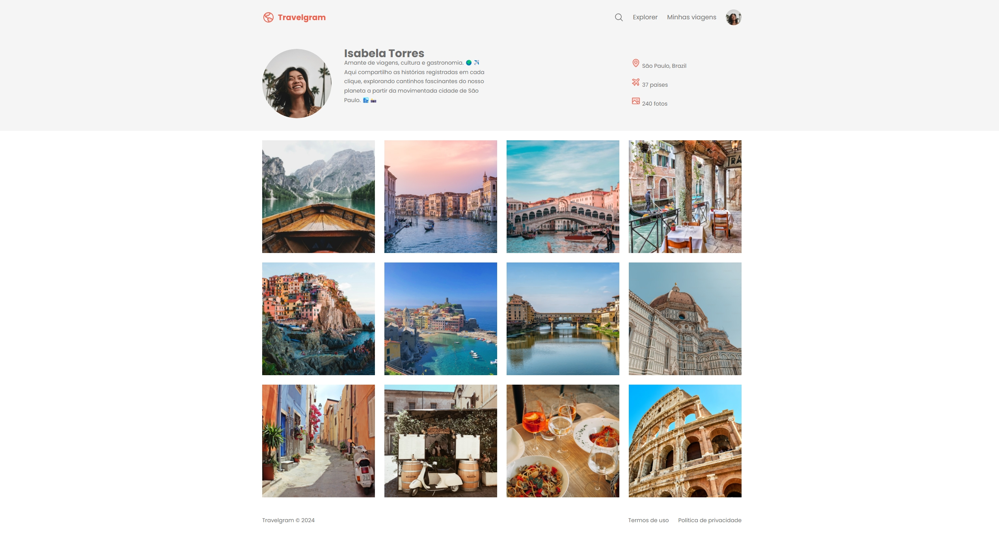

# Travelgram 🌍

**Travelgram** é um site fictício voltado para apaixonados por viagens e fotografia. Ele exibe um perfil de usuário com destinos visitados e fotos de tirar o fôlego de diversos lugares pelo mundo.

  


## 🖥️ Tecnologias Utilizadas

- **HTML5**: Para a estrutura e semântica do site.
- **CSS3**: Para o design e estilização.

## 🎨 Funcionalidades

- Exibição de um perfil de usuário fictício.
- Galeria de fotos  organizada.
- Design simples e moderno, com foco em usabilidade.

## 📂 Estrutura do Projeto

```text
Travelgram/
├── assets/  # Pasta com imagens e icones do projeto
├── styles/   # Pasta com os estilos do projeto
├── index.html      # Pasta com as imagens do projeto
└── README.md    # Documentação do projeto
````

## 🚀 Como Executar

1. Faça o download ou clone este repositório:
   ```bash
   git clone https://github.com/seu-usuario/travelgram.git
   ````
2. Abra o arquivo ````index.html```` em qualquer navegador para visualizar o site.

## 📝 Inspiração

Este projeto foi criado para fins de aprendizado durante o curso de FullStack da Rocketseat,  e prática em HTML e CSS. A inspiração vem de redes sociais focadas em viagens e cultura, como Instagram.

## 💡 Melhorias Futuras

- Adicionar interatividade com JavaScript.
- Implementar suporte a temas claros e escuros.
- Tornar o site mais acessível com práticas de acessibilidade web.


**Desenvolvido por Mateus Ferreira**  
[GitHub](https://github.com/fferreiracanedo) | [LinkedIn](https://www.linkedin.com/in/fferreiracanedo/)
